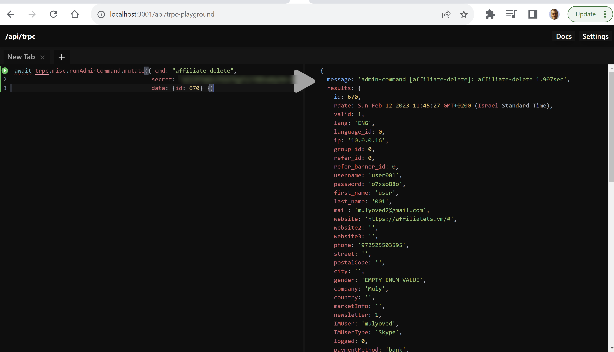
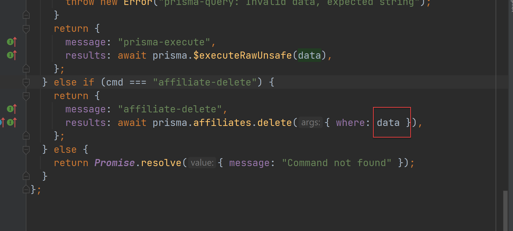

# How to run admin commands

Open [trpc-playground](http://localhost:3001/api/trpc-playground)
https://best-brokers-partners.staging.affiliatets.com/api/trpc-playground



## Delete user

```js
await trpc.misc.runAdminCommand.mutate({
  cmd: "affiliate-delete",
  data: { id: 670 },
});
```

data can be any prisma "where" condition like { mail: "mulyoved@gmail.com" }



For production need to also pass
secret: from .env NEXTAUTH_SECRET
