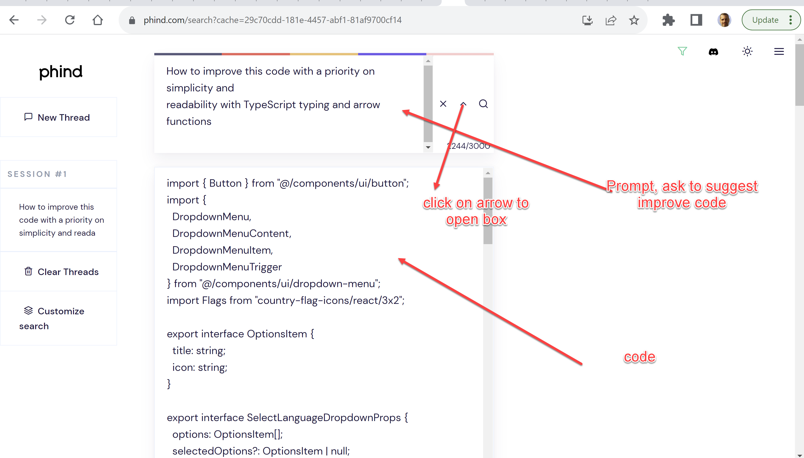

## ChatGPT prompts

https://www.phind.com/

```
How to improve this code with priority on simplicity and
readability with TypeScript typing and arrow functions
```



## Convert code PHP to TypeScript

Can you summarize what this code is doing?

Can you explain what this code is doing step by step

can you extract PHP code, keep all the PHP code and add comment for each step

can you extract all PHP code for item 1, keep it is PHP code and add comment for each step, make sure to extract to complete for each step

can you extract only the code that set the where variable, make sure to include every part of the where condition

can you extract only the code that set the orderBy variable, make sure to include every part of it

can you convert the complete code to typescript and encapsulate the code in a function, make sure to type the parameters and the results, make sure to keep the PHP code in a comments inside the TS code so easy to check the code converted correctly, also explain tricky parts of the conversion in comments, make sure to convert all the code

## Simplify the code, no function or type
can you convert the complete code to typescript, make sure to keep the PHP code in a comments inside the TS code so easy to check the code converted correctly, also explain tricky parts of the conversion in comments, make sure to convert all the code

## Very simple
can you convert the PHP code to typescript
