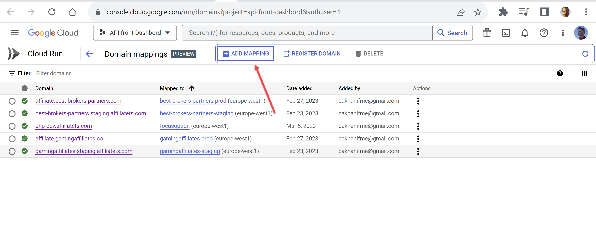
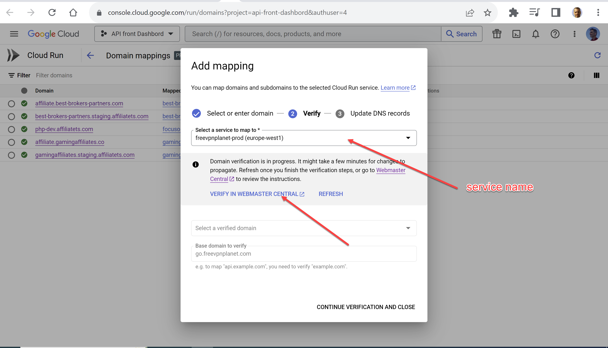
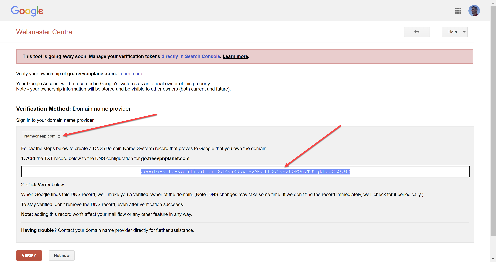
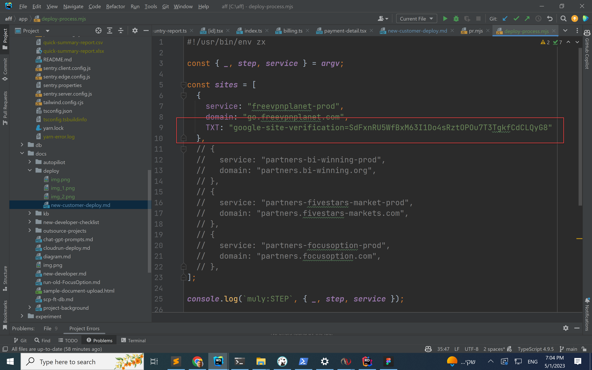

#  Affiliate Dashboard - New customer deploy process

Once customer has database, admin and all setup need to get:
- customer nickname (freevpnplanet)
- domain for new affiliate dashboard (go.freevpnplanet.com)
- domain for admin legacy PHP system (affiliate.freevpnplanet.com)
- database, name, user, password, (from Anton)
- legacy PHP system admin user and password (from Nir)

Once system setup and deployed to GCP need to configure DNS, will provide
- TXT:
- CNAME:

##
id: deploy_partners-focusoption
service: partners-focusoption-prod
domain: partners.focusoption.com
secret: DATABASE_URL=PROD_FOCUSOPTION_DATABASE_URL:latest
NEXTAUTH_URL=https://partners.focusoption.com

- Add block to .github/workflows/cloudrun-prod.yml

## Verify domain
https://console.cloud.google.com/run/domains?project=api-front-dashbord&authuser=4

- 
- 
- 
- 

run `./deploy-process.mjs --step=dns`

## gcloud

- Select Project
gcloud config set project api-front-dashbord
gcloud config set compute/region europe-west1
gcloud compute project-info add-metadata --metadata google-compute-default-region=europe-west1,google-compute-default-zone=europe-west1-b

- Domains
gcloud beta run domain-mappings list --region=europe-west1

service=freevpnplanet-prod
domain=affiliate.freevpnplanet.com

gcloud domains verify $domain --verification-method=DNS

gcloud beta run domain-mappings create --service=$service --domain=$domain --region=europe-west1
gcloud run domain-mappings create --service=partners-bi-winning-prod	 --domain=partners.bi-winning.org
gcloud run domain-mappings create --service=partners-fivestars-market-prod	 --domain=partners.fivestars-markets.com
gcloud run domain-mappings create --service=partners-focusoption-prod  --domain=partners.focusoption.com

