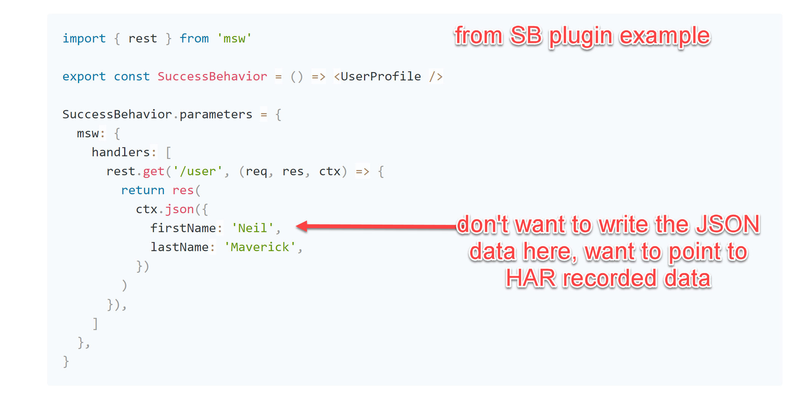

# Add TRPC mock based on MSW to my project

## General

I have TRPC, Nextjs, React project and I use Stroybook for component testing
I want to add mocking of TRPC API call so I can develop component that call TRPC API 
inside storybook, 

The project is to integrate several open source project into one efficient experience

**Can be a good OSS project to one portfolio**

## Links 

- [MSW](https://mswjs.io/)
- [TRPC](https://trpc.io/)
- [Storybook](https://storybook.js.org/)
- [MSW for TRPC](https://github.com/maloguertin/msw-trpc)
- [use HAR files from SMW](https://github.com/Tapico/tapico-msw-webarchive)
- [MSW Addon to Storybook](https://storybook.js.org/addons/msw-storybook-addon/)

# Goals

I don't want to manually write the JSON data for the answers, 
I want to use HAR recording for that and 
have a convenient way to generate those HAR recording

Once HAR recorded, save them as JSON, and can point the storybook test to load it
I may want to run same component with different data

Should be easy to add new recording/scenario 

## Suggested approach

Integrate those into one experience

- [MSW for TRPC](https://github.com/maloguertin/msw-trpc)
- [use HAR files from SMW](https://github.com/Tapico/tapico-msw-webarchive)
- [MSW Addon to Storybook](https://storybook.js.org/addons/msw-storybook-addon/)

## Scope

- GitHub and npm published package one can add to TRPC project
- Add the package to my NodeJS/TRPC project and demonstrate it work
- Write new stories for pages in my project that need TRPC (About 10)
- Document how to create and configure HAR recording
- Optional: Smooth recording experience, A record switch that when on cause the test to actually execute the real request, when off read the request answer from HAR
